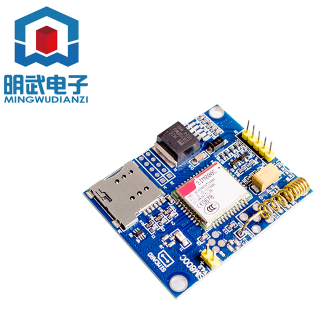
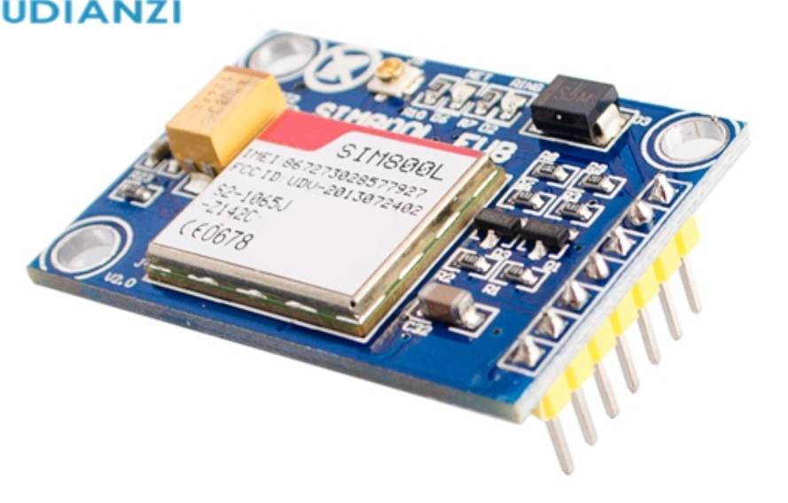
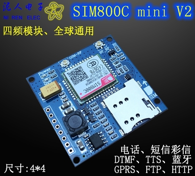

# SIM800模块总结

| 型号                   | 商家           | 电压             | 是否通过测试 | 购买价格 |
| ---------------------- | -------------- | ---------------- | ------------ | -------- |
| 800C,上图1             | 都会明武电子   | 5V--18v          | 是           | 36.70    |
| SIM808,上图3           | 都会明武电子   | 5V               | 是           | 74.00    |
| SIM800C,上图4          | 世讯旗舰店     | 5V               | 否           | 36.00    |
| SIM800C,上图5          | 泥人电子       | 5V--18v          | 是           | 63.00    |
| SIM800C,上图6          | 世讯旗舰店     | 12V（可以用12V） | 是           | 68.00    |
| SIM800C开发板,上图7    | 科易互动       | 6V-12V           | ?            | 60.00    |
| SIM800L EVB V2.0,上图2 | 都会明武电子   | 5V               | 否           | 29.05    |
| SIM800L开发板,上图8    | 穆穆电子       | 6V-12V           | ？           | 26.50    |
| SIM800L开发板,上图8    | 大树聚电子模块 | 3.7~4.2V         | 否           | 5.93     |
