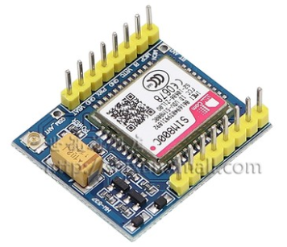

# 测试结果





| 型号                               | 商家           | 电压             | 是否通过测试 | 备注                                                                 | 购买价格(含运费) |
| ---------------------------------- | -------------- | ---------------- | ------------ | -------------------------------------------------------------------- | ---------------- |
| 800C,上图1                         | 都会明武       | 5V--18v          | 是           | 焊有弹簧天线,有ANT接口;VCC与MCU共地                                  | 36.70            |
| SIM800L EVB V2.0,上图2             | 都会明武       | 5V               | 否           | 疑似坏芯片                                                           | 29.05            |
| SIM808,上图3                       | 都会明武       | 5V               | 是           | -                                                                    | 74.00            |
| SIM800C,上图4                      | 世讯旗舰店     | 5V               | 否           | 5V或3.3-4.2V供电,需拉低PWR启动;VCC与MCU共地 ;有ANT接口               | 36.00            |
| SIM800C,上图5                      | 泥人电子       | 5V--18v          | 是           | -                                                                    | 63.00            |
| SIM800C,上图6                      | 世讯旗舰店     | 12V（可以用12V） | 是           | -                                                                    | 68.00            |
| SIM800C开发板,上图7                | 科易互动       | 6V-12V           | 是           | 仅适用于Arduino Uno                                                  | 60.00            |
| SIM800L开发板,上图8                | 穆穆电子       | 3.7~4.2V         | 是           | 绿色指示灯,贴片电阻是471,470欧姆的                                   | 20.75*3=62.25    |
| SIM800L开发板,同上图8,疑似二手芯片 | 大树聚电子模块 | 3.7~4.2V         | 否           | 疑似二手芯片,无法注册SIM卡                                           | 5.93             |
| SIM800L开发板,同上图8              | 深圳市铭源鼎业 | 3.7~4.2V         | 否           | 二手芯片的模块                                                       | 10.75*2+4=25     |
| SIM800L开发板,同上图2,二手芯片     | 深圳明佳泰     | 3.7~4.2V         | 否           | 二手芯片的模块,卖一手芯片的价格                                      | 36.67            |
| SIM800L开发板,同上图2              | 深圳松和       | 5V               | 是           | 芯片的贴纸上有黄色的铜线一样的东西,芯片看起来不像是旧的,但是有这东西 | 27.5*2=55        |
| SIM868开发板,上图9-10              | 大学生电子商铺 | 3.7~4.2V         | 是           | 需要实体串口                                                         | 111.00           |


## 世讯SIM800C模块

世讯旗舰店出售的SIM800C模块,在给定电压是5V时,一直注册不上网络:

```
AT

OK

RDY

+CFUN: 1
AT+CREG?

+CREG: 0,4

OK

+CPIN: READY

Call Ready
AT+CREG?

+CREG: 0,2

OK

SMS Ready
AT+CBC

+CBC: 0,79,4032

OK
AT+CSQ

+CSQ: 20,0

OK
AT+CREG?

+CREG: 0,2

```

CSQ表示网络质量,第一个数字表示信号强度:


CREG表示是否连接到网络:

`0,2`表示正在寻网,`0,5`表示已建立网络连接。

[关于AT命令的说明](https://seeeddoc.github.io/AT_Command_Tester/)


## 深圳明佳泰电子有限公司

挂羊头卖狗肉，商品图与收到的模块不符:

1, 商品图上的PCB丝印显示版本为V2.2,实际收到的是V2.0;
2, 实际收到的商品的PCB布局与商品图展示不一致;
3, 实际收到的商品的SIM800L模块是二手的,这一点确信无疑。


